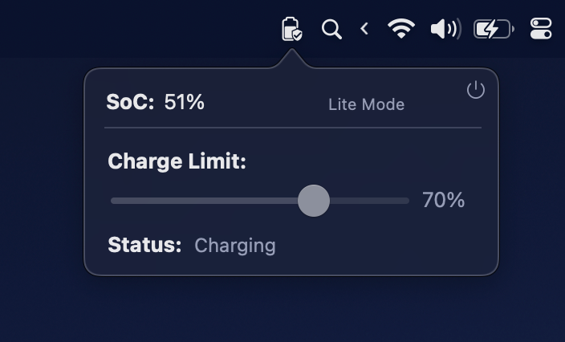

# batteryKid
To [prolong Li-ion based 
batteries](https://www.apple.com/batteries/maximizing-performance/):

> Avoid completely draining the battery and avoid keeping it fully charged for long periods of time. The optimal operating range for Lithium-ion batteries is between 30% and 80% of their capacity.

However, for those who're using MacBooks as their daily workhourse, chances are that the batteries are always 100% for a long period of time.
This small menu bar tool can assist in maintaining the battery health of your MacBook (only compatible with Apple Silicon at present). It has two modes:
1. Lite Mode (Recommended): this mode maintains the State of Charge (SoC) within a range of ±2% of the user-selected value.
2. Pro Mode: this mode exposes the switchs utilized by the lite mode.
   - Charging switch
   - Power source (AC) switch

**Note:**
- batteryKid requires the installation of a privileged helper for full functionality.
- After toggling the charging switch, it may take around 20 seconds for the built-in battery status to reflect the change. The battery is already in a charging or non-charging state during this time.

## Screenshot
### Lite Mode


### Pro Mode


### Acknowledgements
I would like to extend my gratitude to my girlfriend for designing the user interface and icons.

## Uninstalling
1. Quit the app from menu bar
2. Move batteryKid.app into Trash
3. Execute following commands:
```bash
sudo launchctl unload /Library/LaunchDaemons/me.alaneuler.batteryKid.PrivilegeHelper.plist
sudo rm -rf /Library/LaunchDaemons/me.alaneuler.batteryKid.PrivilegeHelper.plist
sudo rm -rf /Library/PrivilegedHelperTools/me.alaneuler.batteryKid.PrivilegeHelper
```

## License
This project is under the MIT License.

## TODO
- [ ] Uninstall and about menu
- [ ] Support clamshell mode

## Used Projects
- [SMCKit](https://github.com/beltex/SMCKit)
- [SMJobBlessUtil-python3.py](https://gist.github.com/mikeyh/89a1e2ecc6849ff6056b7391c5216799)

## Disclaimer
I do not take any responsibility for any sort of damage that may occur from using this tool!
Although it had no negative side effects for me, 
batteryKid still taps in some very low-level system functions 
that are not meant to be tampered with (private APIs).

**Use it at your own risk!**
